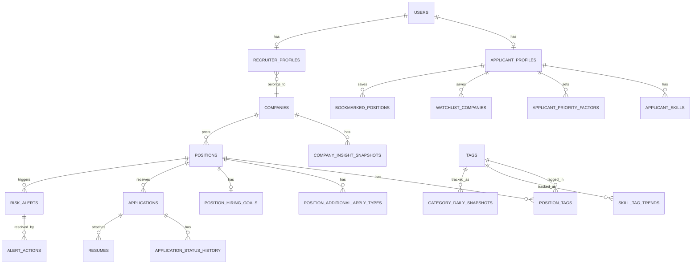

# Wanted 통합 채용 대시보드 DB 설계 (DB.md)

`PRD.md` 기준으로 서비스를 구현할 때 필요한 데이터베이스 스키마를 정의한다. DB는 PostgreSQL을 가정하며(관계형 조회·집계가 많고 태그 다대다 구조가 핵심이라 RDB가 적합), 타입 표기는 PostgreSQL 문법을 따른다.

## 1. 설계 원칙

- **원본 동기화 데이터**와 **자체 집계/배치 데이터**를 테이블 레벨에서 분리한다. 전자는 원티드 API 응답을 그대로 캐싱한 테이블(예: `companies`, `positions`), 후자는 API가 제공하지 않아 우리가 직접 쌓아야 하는 시계열/통계 테이블(예: `position_daily_snapshot`, `skill_tag_trend`)이다. PRD 8장의 제약사항이 여기서 기인한다.
- **공용 데이터 모듈**(PRD 6장, 스킬 태그 트렌드)은 소비 주체(지원자/채용자)와 무관하게 테이블 하나(`skill_tag_trend`)로 두고, 화면마다 다르게 조회한다.
- 지원자의 "포기불가/가중치" 같은 개인화 설정은 매 요청마다 클라이언트에서 계산 가능하도록 원자 값으로 저장한다(구조화된 JSON 대신 정규화 테이블 사용 — 추후 "내가 자주 쓰는 조건 저장" 같은 기능 확장을 고려).
- 민감 정보(지원자 개인정보: 이름/이메일/전화번호, 이력서 파일)는 최소 컬럼만 두고 실제 파일은 별도 스토리지(S3 등) key만 참조한다.

## 2. ERD 개요

## 3. 테이블 정의

### 3.1 계정 / 프로필

**users** — 서비스 공통 계정
| 컬럼 | 타입 | 제약 | 설명 |
|---|---|---|---|
| id | BIGSERIAL | PK | |
| email | VARCHAR(255) | UNIQUE, NOT NULL | |
| password_hash | VARCHAR(255) | NOT NULL | |
| role | VARCHAR(20) | NOT NULL, CHECK IN ('applicant','recruiter') | 지원자/채용자 입장 구분 |
| created_at | TIMESTAMPTZ | NOT NULL DEFAULT now() | |

**applicant_profiles** — 지원자 스펙 (5.1 취준 로드맵, 5.4 맞춤 재정렬의 기반)
| 컬럼 | 타입 | 제약 | 설명 |
|---|---|---|---|
| id | BIGSERIAL | PK | |
| user_id | BIGINT | FK → users.id, UNIQUE | |
| years_experience | NUMERIC(3,1) | | 현재 경력 연차 |
| desired_category_tag_id | BIGINT | FK → tags.id, NULL 허용 | 희망 직군 |
| home_location | VARCHAR(255) | NULL 허용 | 출퇴근거리 계산용, 좌표는 지오코딩 후 별도 저장 |
| home_geo_lat / home_geo_lng | NUMERIC(9,6) | NULL 허용 | 외부 지오코딩 API 연동 필요 (PRD 8장 제약) |
| updated_at | TIMESTAMPTZ | NOT NULL DEFAULT now() | |

**applicant_skills** — 보유 스킬 (다대다)
| 컬럼 | 타입 | 제약 | 설명 |
|---|---|---|---|
| applicant_profile_id | BIGINT | FK → applicant_profiles.id | |
| skill_tag_id | BIGINT | FK → tags.id | |
| PRIMARY KEY | (applicant_profile_id, skill_tag_id) | | |

**recruiter_profiles** — 채용 담당자
| 컬럼 | 타입 | 제약 | 설명 |
|---|---|---|---|
| id | BIGSERIAL | PK | |
| user_id | BIGINT | FK → users.id, UNIQUE | |
| company_id | BIGINT | FK → companies.id | 소속 기업 |

### 3.2 기업 / 공고 (원티드 API 동기화 캐시)

**companies**
| 컬럼 | 타입 | 제약 | 설명 |
|---|---|---|---|
| id | BIGINT | PK | 원티드 company_id 그대로 사용 |
| name | VARCHAR(255) | NOT NULL | |
| biz_number | VARCHAR(20) | NULL 허용 | `/insight/company` 조회 키 |
| logo_url | VARCHAR(500) | | |
| description | TEXT | | |
| synced_at | TIMESTAMPTZ | NOT NULL | 마지막 API 동기화 시각 |

**company_insight_snapshots** — 재무/인력 건강도 (5.2). 값이 주기적으로 바뀌므로 스냅샷 이력으로 저장
| 컬럼 | 타입 | 제약 | 설명 |
|---|---|---|---|
| id | BIGSERIAL | PK | |
| company_id | BIGINT | FK → companies.id | |
| snapshot_date | DATE | NOT NULL | |
| average_salary | INTEGER | | 원 단위, `averageSalary` |
| hire_rate | NUMERIC(5,2) | | `hireRate` |
| left_rate | NUMERIC(5,2) | | `leftRate` |
| employee_change_rate | NUMERIC(5,2) | | `employeeChangeRate` |
| age_years | INTEGER | | `age` |
| sales_amount | BIGINT | | `salesAmount` |
| sales_per_person | BIGINT | | `salesPerPerson` |
| UNIQUE | (company_id, snapshot_date) | | |

**positions** — 공고 원본
| 컬럼 | 타입 | 제약 | 설명 |
|---|---|---|---|
| id | BIGINT | PK | 원티드 position/job id |
| company_id | BIGINT | FK → companies.id | |
| title | VARCHAR(255) | NOT NULL | |
| status | VARCHAR(20) | | `JobStatusEnum` (active/close 등) |
| employment_type | VARCHAR(30) | | |
| due_time | DATE | | 마감일. 5.0-C, 5.6 스캔바 기준 |
| country | VARCHAR(10) | | |
| location | VARCHAR(100) | | |
| full_location | VARCHAR(255) | | |
| geo_lat / geo_lng | NUMERIC(9,6) | NULL 허용 | 출퇴근거리 근사 계산용 |
| reward_total | INTEGER | | 추천 보상금 합계(원) — 급여 아님 |
| reward_recommender | INTEGER | | |
| reward_recommendee | INTEGER | | |
| synced_at | TIMESTAMPTZ | NOT NULL | |

**tags** — 직군/직무/스킬/매력 태그 마스터
| 컬럼 | 타입 | 제약 | 설명 |
|---|---|---|---|
| id | BIGINT | PK | 원티드 tag_id |
| tag_type | VARCHAR(20) | NOT NULL, CHECK IN ('category','subcategory','skill','attraction') | |
| name | VARCHAR(100) | NOT NULL | |
| parent_tag_id | BIGINT | FK → tags.id, NULL 허용 | category의 하위 subcategory 연결용 |

**position_tags** — 공고-태그 다대다 (직군/스킬/매력 태그 공용)
| 컬럼 | 타입 | 제약 | 설명 |
|---|---|---|---|
| position_id | BIGINT | FK → positions.id | |
| tag_id | BIGINT | FK → tags.id | |
| PRIMARY KEY | (position_id, tag_id) | | |

**position_additional_apply_types** — 우대조건 (5.3)
| 컬럼 | 타입 | 제약 | 설명 |
|---|---|---|---|
| position_id | BIGINT | FK → positions.id | |
| apply_type | VARCHAR(20) | CHECK IN ('foreigner','alternative_military','disabled_person') | |
| PRIMARY KEY | (position_id, apply_type) | | |

### 3.3 자체 배치 집계 (API가 제공하지 않는 시계열)

**category_daily_snapshot** — 마켓 홈 Zoom-out/Zoom-in용 일별 집계 (5.0-A, 5.0-B)
| 컬럼 | 타입 | 제약 | 설명 |
|---|---|---|---|
| id | BIGSERIAL | PK | |
| snapshot_date | DATE | NOT NULL | |
| category_tag_id | BIGINT | FK → tags.id | |
| region | VARCHAR(100) | NULL 허용 | 지역별 집계 시 사용, NULL이면 직군 전체 집계 |
| open_count | INTEGER | NOT NULL | 해당일 기준 오픈된 공고 수 |
| new_count | INTEGER | NOT NULL DEFAULT 0 | 신규 등록 |
| closed_count | INTEGER | NOT NULL DEFAULT 0 | 마감 종료 |
| UNIQUE | (snapshot_date, category_tag_id, region) | | |

**skill_tag_trend** — 스킬 태그 트렌드 (5.7, 공용 모듈 — 6장)
| 컬럼 | 타입 | 제약 | 설명 |
|---|---|---|---|
| id | BIGSERIAL | PK | |
| tag_id | BIGINT | FK → tags.id | |
| period_type | VARCHAR(10) | CHECK IN ('week','quarter') | |
| period_start | DATE | NOT NULL | |
| mention_count | INTEGER | NOT NULL | 해당 기간 공고 내 태그 등장 수 |
| delta_pct_vs_prev | NUMERIC(6,2) | | 이전 기간 대비 증감률(%) |
| UNIQUE | (tag_id, period_type, period_start) | | |

**category_market_stats** — 공고 경쟁력 진단용 시장 벤치마크 (5.5)
| 컬럼 | 타입 | 제약 | 설명 |
|---|---|---|---|
| id | BIGSERIAL | PK | |
| category_tag_id | BIGINT | FK → tags.id | |
| snapshot_date | DATE | NOT NULL | |
| reward_avg | INTEGER | | |
| reward_p50 | INTEGER | | |
| reward_p90 | INTEGER | | |
| common_attraction_tag_ids | JSONB | | 해당 직군에서 빈출하는 매력 태그 id 배열 |
| UNIQUE | (category_tag_id, snapshot_date) | | |

**tag_effect_stats** — 매력 태그별 성과 상관관계 (5.5)
| 컬럼 | 타입 | 제약 | 설명 |
|---|---|---|---|
| tag_id | BIGINT | FK → tags.id | |
| snapshot_date | DATE | NOT NULL | |
| avg_applicants | NUMERIC(6,2) | | 해당 태그 부착 공고의 평균 지원자 수 |
| avg_pass_rate | NUMERIC(5,2) | | 평균 서류 합격률 |
| PRIMARY KEY | (tag_id, snapshot_date) | | |

### 3.4 ATS / 지원 관리 (채용자, v1 데이터)

**applications**
| 컬럼 | 타입 | 제약 | 설명 |
|---|---|---|---|
| id | BIGINT | PK | 원티드 application id |
| position_id | BIGINT | FK → positions.id | |
| applicant_name | VARCHAR(100) | | |
| applicant_email | VARCHAR(255) | | |
| applicant_mobile | VARCHAR(30) | | |
| application_type | VARCHAR(20) | CHECK IN ('normal','matchup') | |
| apply_time | TIMESTAMPTZ | NOT NULL | |
| open_time | TIMESTAMPTZ | NULL 허용 | 열람 시각, NULL이면 미열람 |
| status | VARCHAR(20) | NOT NULL | send/pass/hire/reject 등 |
| status_updated_at | TIMESTAMPTZ | | 5.6 정체/지연 판단 기준 |

**application_status_history** — 상태 변경 이력 (5.6 정체·형평성 판단 근거)
| 컬럼 | 타입 | 제약 | 설명 |
|---|---|---|---|
| id | BIGSERIAL | PK | |
| application_id | BIGINT | FK → applications.id | |
| from_status | VARCHAR(20) | | |
| to_status | VARCHAR(20) | NOT NULL | |
| changed_at | TIMESTAMPTZ | NOT NULL | |
| changed_by_user_id | BIGINT | FK → users.id, NULL 허용 | |

**resumes**
| 컬럼 | 타입 | 제약 | 설명 |
|---|---|---|---|
| resume_key | VARCHAR(100) | PK | 스토리지 참조 키 |
| application_id | BIGINT | FK → applications.id | |
| file_name | VARCHAR(255) | | |
| content_type | VARCHAR(100) | | |
| content_length | INTEGER | | |

### 3.5 채용자 전용 — 목표달성/위험알림 (5.6)

**position_hiring_goals** — 목표 달성 예측 스캔바 기준값
| 컬럼 | 타입 | 제약 | 설명 |
|---|---|---|---|
| position_id | BIGINT | PK, FK → positions.id | |
| target_applicant_count | INTEGER | NOT NULL | 목표 지원자 수 (채용담당자 입력) |
| target_date | DATE | | 목표 달성 희망일(보통 due_time과 동일) |

**risk_alerts**
| 컬럼 | 타입 | 제약 | 설명 |
|---|---|---|---|
| id | BIGSERIAL | PK | |
| position_id | BIGINT | FK → positions.id | |
| application_id | BIGINT | FK → applications.id, NULL 허용 | 특정 지원자 단위 알림(형평성/처리지연)일 때만 사용 |
| alert_type | VARCHAR(30) | CHECK IN ('deadline_shortage','stalled_after_pass','unopened','processing_delay','fairness') | |
| severity | VARCHAR(10) | CHECK IN ('high','mid') | |
| detail_text | TEXT | | UI 표시용 상세 문구 |
| detected_at | TIMESTAMPTZ | NOT NULL | |
| status | VARCHAR(10) | CHECK IN ('open','resolved') DEFAULT 'open' | |
| resolved_at | TIMESTAMPTZ | NULL 허용 | |

**alert_actions** — 액션 버튼 클릭 이력 (성공지표 10장의 클릭률 산출 근거)
| 컬럼 | 타입 | 제약 | 설명 |
|---|---|---|---|
| id | BIGSERIAL | PK | |
| risk_alert_id | BIGINT | FK → risk_alerts.id | |
| action_type | VARCHAR(50) | NOT NULL | 예: 'extend_deadline','raise_reward','remind_reviewer','send_delay_message' |
| applied_by_user_id | BIGINT | FK → users.id | |
| applied_at | TIMESTAMPTZ | NOT NULL DEFAULT now() | |

### 3.6 지원자 개인화 (5.4)

**applicant_priority_factors** — 우선순위 설정 (직종/연봉/워라밸/출퇴근거리)
| 컬럼 | 타입 | 제약 | 설명 |
|---|---|---|---|
| id | BIGSERIAL | PK | |
| applicant_profile_id | BIGINT | FK → applicant_profiles.id | |
| factor_key | VARCHAR(20) | CHECK IN ('category','salary','wlb','commute') | |
| is_dealbreaker | BOOLEAN | NOT NULL DEFAULT false | true면 하드필터로 사용 |
| weight | SMALLINT | CHECK (weight BETWEEN 0 AND 5) | 포기불가가 아닐 때 가중치 |
| threshold_value | JSONB | | 조건값. 예: {"min_salary":4500}, {"tags":["재택근무"]}, {"max_km":15}, {"category":"서버 개발"} |
| UNIQUE | (applicant_profile_id, factor_key) | | |

**watchlist_companies** — 기업 건강도 비교 탭에서 선택/저장한 관심기업 (5.2)
| 컬럼 | 타입 | 제약 | 설명 |
|---|---|---|---|
| applicant_profile_id | BIGINT | FK → applicant_profiles.id | |
| company_id | BIGINT | FK → companies.id | |
| PRIMARY KEY | (applicant_profile_id, company_id) | | |

**bookmarked_positions** — 마켓 홈 Action 영역에서 저장한 공고
| 컬럼 | 타입 | 제약 | 설명 |
|---|---|---|---|
| applicant_profile_id | BIGINT | FK → applicant_profiles.id | |
| position_id | BIGINT | FK → positions.id | |
| bookmarked_at | TIMESTAMPTZ | NOT NULL DEFAULT now() | |
| PRIMARY KEY | (applicant_profile_id, position_id) | | |

## 4. 인덱스 전략

| 테이블 | 인덱스 | 이유 |
|---|---|---|
| positions | (status, due_time) | 마감임박 조회(5.0-C, 5.6) |
| positions | (company_id) | 기업별 공고 목록 |
| position_tags | (tag_id) | 태그별 공고 집계(5.0-A, 5.1) |
| category_daily_snapshot | (category_tag_id, snapshot_date DESC) | 최근 7일 트렌드 조회(5.0-B) |
| skill_tag_trend | (period_type, period_start DESC) | 최신 트렌드 조회(5.7) |
| applications | (position_id, status) | 파이프라인 현황 집계(5.6) |
| applications | (open_time) WHERE open_time IS NULL | 미열람 알림 조회 |
| risk_alerts | (position_id, status) | 진행 중인 알림 조회 |

## 5. PRD ↔ 테이블 매핑 요약

| PRD 섹션 | 핵심 테이블 |
|---|---|
| 5.0 마켓 홈 | `category_daily_snapshot`, `positions`, `position_tags`, `bookmarked_positions` |
| 5.1 취준 로드맵 | `applicant_profiles`, `applicant_skills`, `positions`, `position_tags`, `skill_tag_trend` |
| 5.2 기업 건강도 비교 | `companies`, `company_insight_snapshots`, `watchlist_companies` |
| 5.3 우대조건 필터 | `position_additional_apply_types` |
| 5.4 맞춤 공고 재정렬 | `applicant_priority_factors`, `positions`, `position_tags` |
| 5.5 공고 경쟁력 진단 | `positions`, `category_market_stats`, `tag_effect_stats` |
| 5.6 파이프라인 위험 알림 | `position_hiring_goals`, `applications`, `application_status_history`, `risk_alerts`, `alert_actions` |
| 5.7 채용 조건 트렌드 | `skill_tag_trend` (5.0, 5.1과 공유) |

## 6. 배치/동기화 잡 개요

- **실시간/준실시간 동기화**: `companies`, `positions`, `position_tags`, `position_additional_apply_types`, `applications` — 원티드 API를 주기적으로(예: 1시간 간격) 폴링해 upsert
- **일 배치**: `category_daily_snapshot`(자정 기준 스냅샷), `company_insight_snapshots`(변경 빈도 낮아 1일 1회)
- **주/분기 배치**: `skill_tag_trend`(주간 집계 후 분기 델타 계산), `category_market_stats`, `tag_effect_stats`
- **이벤트 기반 계산**: `risk_alerts`는 스케줄러가 위 테이블들을 주기적으로 스캔해 조건(마감 D-3 이내 & 목표 대비 지원율 50% 미만 등)에 맞으면 생성, 조건 해소 시 `status='resolved'`로 갱신

## 7. 설계 상 유의사항 (PRD 제약사항과 연결)

- `positions.reward_total`은 급여가 아닌 추천 보상금이므로, 연봉 근사치가 필요한 화면(5.4)에서는 `company_insight_snapshots.average_salary`를 참조하되 회사 단위 근사치라는 점을 애플리케이션 레벨에서 명시해야 한다.
- `applicant_profiles.home_geo_lat/lng`와 `positions.geo_lat/lng`는 원티드 API의 `geo_location`이 실제로 좌표를 제공하는지 우선 검증이 필요하며, 없다면 외부 지오코딩 API로 별도 채워야 한다.
- `risk_alerts`의 `fairness` 타입은 동일 `position_id` 내 `application_status_history` 처리시간 표준편차/배수를 계산해야 하므로, 지원자 수가 일정 수(예: 5건) 미만인 공고는 통계적 오탐 방지를 위해 알림 생성 대상에서 제외하는 것을 애플리케이션 로직에 명시한다.
- 개인정보(지원자 이름/이메일/전화번호)가 담긴 `applications` 테이블은 접근 권한을 해당 공고를 게시한 `recruiter_profiles.company_id`로 제한해야 한다.
