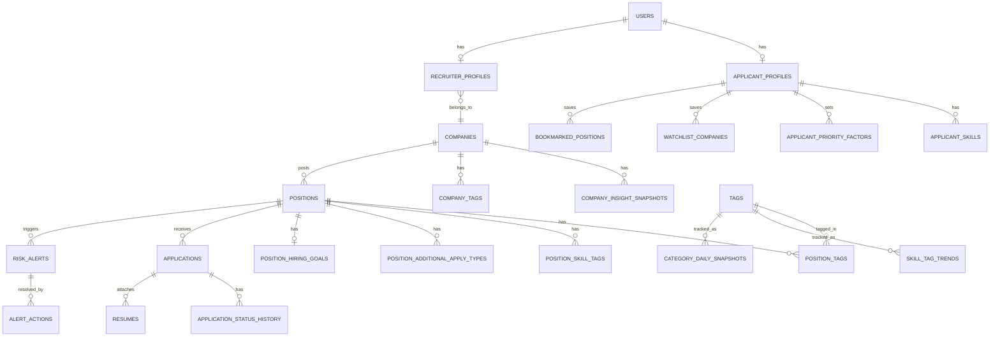

# Wanted 통합 채용 대시보드 DB 설계 (DB.md)

`PRD.md` 기준으로 서비스를 구현할 때 필요한 데이터베이스 스키마를 정의한다. DB는 PostgreSQL을 가정하며(관계형 조회·집계가 많고 태그 다대다 구조가 핵심이라 RDB가 적합), 타입 표기는 PostgreSQL 문법을 따른다.

## 1. 설계 원칙

- **원본 동기화 데이터**와 **자체 집계/배치 데이터**를 테이블 레벨에서 분리한다. 전자는 원티드 API 응답을 그대로 캐싱한 테이블(예: `companies`, `positions`), 후자는 API가 제공하지 않아 우리가 직접 쌓아야 하는 시계열/통계 테이블(예: `position_daily_snapshot`, `skill_tag_trend`)이다. PRD 8장의 제약사항이 여기서 기인한다.
- **공용 데이터 모듈**(PRD 6장, 스킬 태그 트렌드)은 소비 주체(지원자/채용자)와 무관하게 테이블 하나(`skill_tag_trend`)로 두고, 화면마다 다르게 조회한다.
- 지원자의 "포기불가/가중치" 같은 개인화 설정은 매 요청마다 클라이언트에서 계산 가능하도록 원자 값으로 저장한다(구조화된 JSON 대신 정규화 테이블 사용 — 추후 "내가 자주 쓰는 조건 저장" 같은 기능 확장을 고려).
- 민감 정보(지원자 개인정보: 이름/이메일/전화번호, 이력서 파일)는 최소 컬럼만 두고 실제 파일은 별도 스토리지(S3 등) key만 참조한다.

## 2. ERD 개요

## 3. 테이블 정의

### 3.1 계정 / 프로필

**users** — 서비스 공통 계정
| 컬럼 | 타입 | 제약 | 설명 |
|---|---|---|---|
| id | BIGSERIAL | PK | |
| email | VARCHAR(255) | UNIQUE, NOT NULL | |
| password_hash | VARCHAR(255) | NOT NULL | |
| role | VARCHAR(20) | NOT NULL, CHECK IN ('applicant','recruiter') | 지원자/채용자 입장 구분 |
| created_at | TIMESTAMPTZ | NOT NULL DEFAULT now() | |

**applicant_profiles** — 지원자 스펙 (5.1 취준 로드맵, 5.4 맞춤 재정렬의 기반)
| 컬럼 | 타입 | 제약 | 설명 |
|---|---|---|---|
| id | BIGSERIAL | PK | |
| user_id | BIGINT | FK → users.id, UNIQUE | |
| years_experience | NUMERIC(3,1) | | 현재 경력 연차 |
| desired_category_tag_id | BIGINT | FK → tags.id, NULL 허용 | 희망 직군 |
| home_location | VARCHAR(255) | NULL 허용 | 출퇴근거리 계산용, 좌표는 지오코딩 후 별도 저장 |
| home_geo_lat / home_geo_lng | NUMERIC(9,6) | NULL 허용 | 외부 지오코딩 API 연동 필요 (PRD 8장 제약) |
| updated_at | TIMESTAMPTZ | NOT NULL DEFAULT now() | |

**applicant_skills** — 보유 스킬 (다대다)
| 컬럼 | 타입 | 제약 | 설명 |
|---|---|---|---|
| applicant_profile_id | BIGINT | FK → applicant_profiles.id | |
| skill_tag_id | BIGINT | FK → tags.id | |
| PRIMARY KEY | (applicant_profile_id, skill_tag_id) | | |

**recruiter_profiles** — 채용 담당자
| 컬럼 | 타입 | 제약 | 설명 |
|---|---|---|---|
| id | BIGSERIAL | PK | |
| user_id | BIGINT | FK → users.id, UNIQUE | |
| company_id | BIGINT | FK → companies.id | 소속 기업 |

### 3.2 기업 / 공고 (원티드 API 동기화 캐시)

**companies**
| 컬럼 | 타입 | 제약 | 설명 |
|---|---|---|---|
| id | BIGINT | PK | 원티드 company_id 그대로 사용 |
| name | VARCHAR(255) | NOT NULL | |
| registration_number | VARCHAR(20) | NULL 허용 | 사업자등록번호. `/insight/company` 조회 키로도 사용 (기존 설계의 `biz_number`를 실제 API 필드명에 맞춰 개명) |
| logo_url | VARCHAR(500) | | |
| description | TEXT | | |
| link | VARCHAR(500) | | 기업 홈페이지 링크(`CompanyDetailResponseSerializer.link`) |
| synced_at | TIMESTAMPTZ | NOT NULL | 마지막 API 동기화 시각 |

**company_tags** — 회사 단위 배지성 태그 (`JobCompanyResponseSerializer.company_tags`)
| 컬럼 | 타입 | 제약 | 설명 |
|---|---|---|---|
| company_id | BIGINT | FK → companies.id | |
| tag_type_id | BIGINT | NOT NULL | 원티드가 매기는 태그ID. **`tags` 마스터(직군/직무/매력)와는 별개의 ID 체계**라 FK로 걸지 않는다 |
| title | VARCHAR(100) | NOT NULL | 예: "재택근무", "설립4~9년", "퇴사율5%이하" |
| PRIMARY KEY | (company_id, tag_type_id) | | |

> ⚠️ 공고 단위(`position_tags`)로는 여전히 매력 태그를 못 채우지만(3.2절 아래 유의사항 참고), **회사 단위로는 이런 배지 태그가 실제로 존재**한다는 걸 `job_details.csv` 실데이터로 확인했다. "재택근무"/"유연근무" 같은 워라밸 근사값을 회사 단위로는 이 테이블로 대체 활용할 수 있다(PRD 5.4/5.5 참고).

**company_insight_snapshots** — 재무/인력 건강도 (5.2). 값이 주기적으로 바뀌므로 스냅샷 이력으로 저장
| 컬럼 | 타입 | 제약 | 설명 |
|---|---|---|---|
| id | BIGSERIAL | PK | |
| company_id | BIGINT | FK → companies.id | |
| snapshot_date | DATE | NOT NULL | |
| average_salary | INTEGER | | 원 단위, `averageSalary` |
| hire_rate | NUMERIC(5,2) | | `hireRate` |
| left_rate | NUMERIC(5,2) | | `leftRate` |
| employee_change_rate | NUMERIC(5,2) | | `employeeChangeRate` |
| age_years | INTEGER | | `age` |
| sales_amount | BIGINT | | `salesAmount` |
| sales_per_person | BIGINT | | `salesPerPerson` |
| UNIQUE | (company_id, snapshot_date) | | |

**positions** — 공고 원본
| 컬럼 | 타입 | 제약 | 설명 |
|---|---|---|---|
| id | BIGINT | PK | 원티드 position/job id |
| company_id | BIGINT | FK → companies.id | |
| title | VARCHAR(255) | NOT NULL | |
| status | VARCHAR(20) | | `JobStatusEnum` (active/close 등) |
| employment_type | VARCHAR(30) | | |
| due_time | DATE | | 마감일. 5.0-C, 5.6 스캔바 기준 |
| country | VARCHAR(10) | | |
| location | VARCHAR(100) | | |
| full_location | VARCHAR(255) | | |
| geo_lat / geo_lng | NUMERIC(9,6) | NULL 허용 | 출퇴근거리 근사 계산용. v1 상세조회 `address.geo_location.location.lat/lng`(확인 완료) |
| annual_from / annual_to | INTEGER | NULL 허용 | 요구 연차 범위(신입=0). v1 상세조회 `annual_from`/`annual_to` |
| intro / main_tasks / requirements / preferred_points / benefits / hire_rounds | TEXT | NULL 허용 | 공고 상세 텍스트(회사소개/주요업무/자격요건/우대사항/혜택/채용전형). v1 상세조회 `detail.*`. 5.6 액션 버튼이 `PATCH /recruit-company/position/{id}`를 호출할 때 "detail은 한 세트로 취급"되므로 이 필드들을 먼저 저장해둬야 부분 수정 시 나머지 값을 그대로 되돌려보낼 수 있다 |
| reward_total | INTEGER | | 추천 보상금 합계(원) — 급여 아님 |
| reward_recommender | INTEGER | | |
| reward_recommendee | INTEGER | | |
| synced_at | TIMESTAMPTZ | NOT NULL | |

**tags** — 직군/직무/스킬/매력 태그 마스터
| 컬럼 | 타입 | 제약 | 설명 |
|---|---|---|---|
| id | BIGINT | PK | 원티드 tag_id |
| tag_type | VARCHAR(20) | NOT NULL, CHECK IN ('category','subcategory','skill','attraction') | |
| name | VARCHAR(100) | NOT NULL | |
| parent_tag_id | BIGINT | FK → tags.id, NULL 허용 | category의 하위 subcategory 연결용 |

**position_tags** — 공고-태그 다대다 (직군/스킬/매력 태그 공용)
| 컬럼 | 타입 | 제약 | 설명 |
|---|---|---|---|
| position_id | BIGINT | FK → positions.id | |
| tag_id | BIGINT | FK → tags.id | |
| PRIMARY KEY | (position_id, tag_id) | | |

> ⚠️ v2 `/jobs` 목록 응답(`JobListDetailResponseSerializer`)에는 `category_tags`만 필드로 내려온다. 태그 종류별로 실제 확보 경로가 다르다:
> - **category/subcategory**: v2 목록 응답에 바로 포함 → 지금처럼 실시간 배치로 채움
> - **skill**: v2 목록엔 없지만 v1 `GET /jobs/{job_id}` 상세조회의 `skill_tags` 필드에 존재한다. 다만 실제 응답을 까보니 **`skill_tags[].id`가 전부 `null`로 내려온다** — 안정적인 Wanted tag_id가 없다는 뜻이라, `tags`/`position_tags`(실제 tag_id 기반) 체계에는 넣지 않고 **이름 기반의 `position_skill_tags` 테이블로 별도 관리**한다(아래 참고)
> - **attraction**: v1/v2 어느 응답에도 공고 단위로 내려오는 필드가 없다. `/tags/attractions`(마스터 목록)와 v2 검색 필터(`attraction_tags=`)로만 존재하므로, 태그ID별로 필터 질의해서 결과에 포함되는 포지션ID를 역산하는 방식(태그 수만큼 N회 호출)만 가능하다 — 비용 대비 실효성을 검증하기 전까진 `position_tags`에 attraction 타입 행을 채우지 않는다. 대신 회사 단위로는 `company_tags`에 유사한 배지(재택근무 등)가 실제로 존재한다(3.2절 상단 참고)

**position_skill_tags** — 공고별 스킬 태그 (이름 기반, 5.0-C/5.1/5.7)
| 컬럼 | 타입 | 제약 | 설명 |
|---|---|---|---|
| position_id | BIGINT | FK → positions.id | |
| skill_name | VARCHAR(100) | NOT NULL | 원티드 `skill_tags[].title`. `id`가 없어 이름 자체를 키로 사용 |
| PRIMARY KEY | (position_id, skill_name) | | |

> `tags` 마스터에 스킬 태그를 편입하지 않는 이유: `tags.id`는 원티드가 발급한 안정적 tag_id를 그대로 쓰는 게 전제인데, 스킬은 그 id가 없다. 같은 이름이라도 표기가 다르면(`Node.js` vs `NodeJS`) 다른 스킬로 집계되는 한계가 있으며, 이는 5.7 스킬 태그 트렌드 집계 시 이름 정규화(대소문자/특수문자 통일 등)가 필요하다는 뜻이다.

**position_additional_apply_types** — 우대조건 (5.3)
| 컬럼 | 타입 | 제약 | 설명 |
|---|---|---|---|
| position_id | BIGINT | FK → positions.id | |
| apply_type | VARCHAR(20) | CHECK IN ('foreigner','alternative_military','disabled_person') | |
| PRIMARY KEY | (position_id, apply_type) | | |

### 3.3 자체 배치 집계 (API가 제공하지 않는 시계열)

**category_daily_snapshot** — 마켓 홈 Zoom-out/Zoom-in용 일별 집계 (5.0-A, 5.0-B)
| 컬럼 | 타입 | 제약 | 설명 |
|---|---|---|---|
| id | BIGSERIAL | PK | |
| snapshot_date | DATE | NOT NULL | |
| category_tag_id | BIGINT | FK → tags.id | |
| region | VARCHAR(100) | NULL 허용 | 지역별 집계 시 사용, NULL이면 직군 전체 집계 |
| open_count | INTEGER | NOT NULL | 해당일 기준 오픈된 공고 수 |
| new_count | INTEGER | NOT NULL DEFAULT 0 | 신규 등록 |
| closed_count | INTEGER | NOT NULL DEFAULT 0 | 마감 종료 |
| UNIQUE | (snapshot_date, category_tag_id, region) | | |

**skill_tag_trend** — 스킬 태그 트렌드 (5.7, 공용 모듈 — 6장)
| 컬럼 | 타입 | 제약 | 설명 |
|---|---|---|---|
| id | BIGSERIAL | PK | |
| tag_id | BIGINT | FK → tags.id | |
| period_type | VARCHAR(10) | CHECK IN ('week','quarter') | |
| period_start | DATE | NOT NULL | |
| mention_count | INTEGER | NOT NULL | 해당 기간 공고 내 태그 등장 수 |
| delta_pct_vs_prev | NUMERIC(6,2) | | 이전 기간 대비 증감률(%) |
| UNIQUE | (tag_id, period_type, period_start) | | |

**category_market_stats** — 공고 경쟁력 진단용 시장 벤치마크 (5.5)
| 컬럼 | 타입 | 제약 | 설명 |
|---|---|---|---|
| id | BIGSERIAL | PK | |
| category_tag_id | BIGINT | FK → tags.id | |
| snapshot_date | DATE | NOT NULL | |
| reward_avg | INTEGER | | |
| reward_p50 | INTEGER | | |
| reward_p90 | INTEGER | | |
| common_attraction_tag_ids | JSONB | | 해당 직군에서 빈출하는 매력 태그 id 배열 |
| UNIQUE | (category_tag_id, snapshot_date) | | |

**tag_effect_stats** — 매력 태그별 성과 상관관계 (5.5)
| 컬럼 | 타입 | 제약 | 설명 |
|---|---|---|---|
| tag_id | BIGINT | FK → tags.id | |
| snapshot_date | DATE | NOT NULL | |
| avg_applicants | NUMERIC(6,2) | | 해당 태그 부착 공고의 평균 지원자 수 |
| avg_pass_rate | NUMERIC(5,2) | | 평균 서류 합격률 |
| PRIMARY KEY | (tag_id, snapshot_date) | | |

### 3.4 ATS / 지원 관리 (채용자, v1 데이터)

> ⚠️ 아래 테이블은 v1 `/ats/*`, `/recruit-company/*` 엔드포인트로 채워지는데, 이 엔드포인트들은 공용 `Wanted_ClientId_API_KEY`/`Wanted_ClientSecret_API_KEY`(헤더 `wanted-client-id`/`wanted-client-secret`) 외에 **기업별로 별도 발급되는 `X-Wanted-Dashboard-Service-Key` 헤더가 추가로 필요**하다(`json.v1`의 `/recruit-company/company/info`, `/ats/positions` 등 참조). 현재 `.env`에는 이 키가 없으므로, 발급 전까지는 3.4 테이블에 실데이터를 채울 수 없다 — 스키마만 선반영해둔다.

**applications**
| 컬럼 | 타입 | 제약 | 설명 |
|---|---|---|---|
| id | BIGINT | PK | 원티드 application id |
| position_id | BIGINT | FK → positions.id | |
| applicant_name | VARCHAR(100) | | |
| applicant_email | VARCHAR(255) | | |
| applicant_mobile | VARCHAR(30) | | |
| application_type | VARCHAR(20) | CHECK IN ('normal','matchup') | |
| apply_time | TIMESTAMPTZ | NOT NULL | |
| open_time | TIMESTAMPTZ | NULL 허용 | 열람 시각, NULL이면 미열람 |
| status | VARCHAR(20) | NOT NULL | send/pass/hire/reject 등 |
| status_updated_at | TIMESTAMPTZ | | 5.6 정체/지연 판단 기준 |

**application_status_history** — 상태 변경 이력 (5.6 정체·형평성 판단 근거)
| 컬럼 | 타입 | 제약 | 설명 |
|---|---|---|---|
| id | BIGSERIAL | PK | |
| application_id | BIGINT | FK → applications.id | |
| from_status | VARCHAR(20) | | |
| to_status | VARCHAR(20) | NOT NULL | |
| changed_at | TIMESTAMPTZ | NOT NULL | |
| changed_by_user_id | BIGINT | FK → users.id, NULL 허용 | |

> ⚠️ 원티드 API는 지원서의 **현재 `status` 한 값만** 제공하며, 상태 변경 이력을 돌려주는 필드/엔드포인트가 없다. 이 테이블은 API 응답을 그대로 옮겨 담는 게 아니라, **동기화 배치가 매번 폴링할 때 직전에 저장해둔 `applications.status`와 이번에 받은 값을 비교해서 다르면 직접 한 행을 생성**하는 방식으로만 채워진다. 폴링 주기(예: 1시간)보다 짧게 여러 번 상태가 바뀌면 중간 전이는 유실된다.

**resumes**
| 컬럼 | 타입 | 제약 | 설명 |
|---|---|---|---|
| resume_key | VARCHAR(100) | PK | 스토리지 참조 키 |
| application_id | BIGINT | FK → applications.id | |
| file_name | VARCHAR(255) | | |
| content_type | VARCHAR(100) | | |
| content_length | INTEGER | | |

### 3.5 채용자 전용 — 목표달성/위험알림 (5.6)

**position_hiring_goals** — 목표 달성 예측 스캔바 기준값
| 컬럼 | 타입 | 제약 | 설명 |
|---|---|---|---|
| position_id | BIGINT | PK, FK → positions.id | |
| target_applicant_count | INTEGER | NOT NULL | 목표 지원자 수 (채용담당자 입력) |
| target_date | DATE | | 목표 달성 희망일(보통 due_time과 동일) |

**risk_alerts**
| 컬럼 | 타입 | 제약 | 설명 |
|---|---|---|---|
| id | BIGSERIAL | PK | |
| position_id | BIGINT | FK → positions.id | |
| application_id | BIGINT | FK → applications.id, NULL 허용 | 특정 지원자 단위 알림(형평성/처리지연)일 때만 사용 |
| alert_type | VARCHAR(30) | CHECK IN ('deadline_shortage','stalled_after_pass','unopened','processing_delay','fairness') | |
| severity | VARCHAR(10) | CHECK IN ('high','mid') | |
| detail_text | TEXT | | UI 표시용 상세 문구 |
| detected_at | TIMESTAMPTZ | NOT NULL | |
| status | VARCHAR(10) | CHECK IN ('open','resolved') DEFAULT 'open' | |
| resolved_at | TIMESTAMPTZ | NULL 허용 | |

**alert_actions** — 액션 버튼 클릭 이력 (성공지표 10장의 클릭률 산출 근거)
| 컬럼 | 타입 | 제약 | 설명 |
|---|---|---|---|
| id | BIGSERIAL | PK | |
| risk_alert_id | BIGINT | FK → risk_alerts.id | |
| action_type | VARCHAR(50) | NOT NULL | 예: 'extend_deadline','raise_reward','remind_reviewer','send_delay_message' |
| applied_by_user_id | BIGINT | FK → users.id | |
| applied_at | TIMESTAMPTZ | NOT NULL DEFAULT now() | |

### 3.6 지원자 개인화 (5.4)

**applicant_priority_factors** — 우선순위 설정 (직종/연봉/워라밸/출퇴근거리)
| 컬럼 | 타입 | 제약 | 설명 |
|---|---|---|---|
| id | BIGSERIAL | PK | |
| applicant_profile_id | BIGINT | FK → applicant_profiles.id | |
| factor_key | VARCHAR(20) | CHECK IN ('category','salary','wlb','commute') | |
| is_dealbreaker | BOOLEAN | NOT NULL DEFAULT false | true면 하드필터로 사용 |
| weight | SMALLINT | CHECK (weight BETWEEN 0 AND 5) | 포기불가가 아닐 때 가중치 |
| threshold_value | JSONB | | 조건값. 예: {"min_salary":4500}, {"tags":["재택근무"]}, {"max_km":15}, {"category":"서버 개발"} |
| UNIQUE | (applicant_profile_id, factor_key) | | |

**watchlist_companies** — 기업 건강도 비교 탭에서 선택/저장한 관심기업 (5.2)
| 컬럼 | 타입 | 제약 | 설명 |
|---|---|---|---|
| applicant_profile_id | BIGINT | FK → applicant_profiles.id | |
| company_id | BIGINT | FK → companies.id | |
| PRIMARY KEY | (applicant_profile_id, company_id) | | |

**bookmarked_positions** — 마켓 홈 Action 영역에서 저장한 공고
| 컬럼 | 타입 | 제약 | 설명 |
|---|---|---|---|
| applicant_profile_id | BIGINT | FK → applicant_profiles.id | |
| position_id | BIGINT | FK → positions.id | |
| bookmarked_at | TIMESTAMPTZ | NOT NULL DEFAULT now() | |
| PRIMARY KEY | (applicant_profile_id, position_id) | | |

## 4. 인덱스 전략

| 테이블 | 인덱스 | 이유 |
|---|---|---|
| positions | (status, due_time) | 마감임박 조회(5.0-C, 5.6) |
| positions | (company_id) | 기업별 공고 목록 |
| position_tags | (tag_id) | 태그별 공고 집계(5.0-A, 5.1) |
| position_skill_tags | (skill_name) | 스킬별 공고 집계(5.1, 5.7) |
| category_daily_snapshot | (category_tag_id, snapshot_date DESC) | 최근 7일 트렌드 조회(5.0-B) |
| skill_tag_trend | (period_type, period_start DESC) | 최신 트렌드 조회(5.7) |
| applications | (position_id, status) | 파이프라인 현황 집계(5.6) |
| applications | (open_time) WHERE open_time IS NULL | 미열람 알림 조회 |
| risk_alerts | (position_id, status) | 진행 중인 알림 조회 |

## 5. PRD ↔ 테이블 매핑 요약

| PRD 섹션 | 핵심 테이블 |
|---|---|
| 5.0 마켓 홈 | `category_daily_snapshot`, `positions`, `position_tags`, `position_skill_tags`, `bookmarked_positions` |
| 5.1 취준 로드맵 | `applicant_profiles`, `applicant_skills`, `positions`, `position_tags`, `position_skill_tags`, `skill_tag_trend` |
| 5.2 기업 건강도 비교 | `companies`, `company_insight_snapshots`, `watchlist_companies` |
| 5.3 우대조건 필터 | `position_additional_apply_types` |
| 5.4 맞춤 공고 재정렬 | `applicant_priority_factors`, `positions`, `position_tags`, `company_tags`(워라밸 근사) |
| 5.5 공고 경쟁력 진단 | `positions`, `category_market_stats`, `tag_effect_stats`, `company_tags`(매력 태그 근사) |
| 5.6 파이프라인 위험 알림 | `position_hiring_goals`, `applications`, `application_status_history`, `risk_alerts`, `alert_actions` |
| 5.7 채용 조건 트렌드 | `position_skill_tags`, `skill_tag_trend` (5.0, 5.1과 공유) |

## 6. 배치/동기화 잡 개요

- **실시간/준실시간 동기화**: `companies`, `positions`, `position_tags`(category/subcategory), `position_additional_apply_types` — v2 `/jobs` 목록을 주기적으로(예: 1시간 간격) 폴링해 upsert. `positions.geo_lat/lng`·상세 텍스트 필드·`position_skill_tags`·`company_tags`는 신규·갱신된 공고에 한해 v1 `/jobs/{id}` 상세조회를 추가로 호출하는 2단계 배치로 채운다(현재는 CSV 일괄 적재로 1회성 스냅샷만 반영했고, 반복 실행되는 자동 배치는 아직 없음 — 9절 참고). `applications`는 `X-Wanted-Dashboard-Service-Key` 확보 후 폴링하며, 폴링 시점마다 `application_status_history`도 함께 갱신(3.4절 참조)
- **일 배치**: `category_daily_snapshot`(자정 기준 스냅샷), `company_insight_snapshots`(변경 빈도 낮아 1일 1회)
- **주/분기 배치**: `skill_tag_trend`(주간 집계 후 분기 델타 계산), `category_market_stats`, `tag_effect_stats`
- **이벤트 기반 계산**: `risk_alerts`는 스케줄러가 위 테이블들을 주기적으로 스캔해 조건(마감 D-3 이내 & 목표 대비 지원율 50% 미만 등)에 맞으면 생성, 조건 해소 시 `status='resolved'`로 갱신

## 7. 설계 상 유의사항 (PRD 제약사항과 연결)

- `positions.reward_total`은 급여가 아닌 추천 보상금이므로, 연봉 근사치가 필요한 화면(5.4)에서는 `company_insight_snapshots.average_salary`를 참조하되 회사 단위 근사치라는 점을 애플리케이션 레벨에서 명시해야 한다.
- `positions.geo_lat/lng`는 v2 목록 응답이 아니라 **v1 `/jobs/{job_id}` 상세조회의 `address.geo_location.location.lat`/`.lng`**(실제 응답으로 확인 완료, 스펙엔 `type: object`로만 적혀 있었지만 실호출 결과 확정됨)가 1차 소스이고, 이 값이 비어있거나 상세조회를 아직 안 한 공고는 카카오 로컬 API(`Map_API_KEY`, REST 키 — 서버 사이드 전용, 도메인 제한 없음)로 `full_location` 주소를 좌표로 변환해 채운다. `applicant_profiles.home_geo_lat/lng`는 원티드 API 대상이 아니므로 카카오 로컬 API로만 채운다.
- `risk_alerts`의 `fairness` 타입은 동일 `position_id` 내 `application_status_history` 처리시간 표준편차/배수를 계산해야 하므로, 지원자 수가 일정 수(예: 5건) 미만인 공고는 통계적 오탐 방지를 위해 알림 생성 대상에서 제외하는 것을 애플리케이션 로직에 명시한다.
- 개인정보(지원자 이름/이메일/전화번호)가 담긴 `applications` 테이블은 접근 권한을 해당 공고를 게시한 `recruiter_profiles.company_id`로 제한해야 한다.

## 8. API 키 ↔ 데이터 소스 매핑 (`.env.example` 기준)

| 키 | 용도 | 채워지는 테이블 |
|---|---|---|
| `Wanted_ClientId_API_KEY` / `Wanted_ClientSecret_API_KEY` | 원티드 공용 OpenAPI 인증 헤더(`wanted-client-id`/`wanted-client-secret`). v1·v2 공통 엔드포인트에서 사용 | v2 `/jobs` → `companies`, `positions`, `tags`(category/subcategory), `position_tags`, `position_additional_apply_types` / v1 `/jobs/{id}` 상세조회 → `positions.geo_lat/lng`·상세 텍스트 필드, `position_skill_tags`, `company_tags`, `companies`(registration_number/link/description 보강) / v1 `/insight/company` → `company_insight_snapshots` |
| *(미보유)* `X-Wanted-Dashboard-Service-Key` | 기업별 ATS 대시보드 연동 키. 공용 Client ID/Secret과 별도로, 원티드에서 기업 단위로 추가 발급받아야 함 | v1 `/ats/*`, `/recruit-company/*` → `applications`, `application_status_history`, `resumes`, `position_hiring_goals`(3.4절) — **현재 키 미보유로 실데이터 연동 불가, 스키마만 대기 상태** |
| `Map_API_KEY` (카카오 디벨로퍼스 REST API 키) | 카카오 로컬 API(주소→좌표 지오코딩). 서버에서만 호출, 도메인 제한 없이 키 값 자체가 비밀값 | `positions.geo_lat/geo_lng`, `applicant_profiles.home_geo_lat/lng` |
| `SUPABASE_URL` / `SUPABASE_ANON_KEY` | 실제 DB 호스팅(Supabase Postgres) 접속 정보. anon 키는 공개용이며 RLS로 접근을 제어 | 전체 테이블의 물리적 저장소 |

집계 테이블(`category_daily_snapshot`, `skill_tag_trend`, `category_market_stats`, `tag_effect_stats`) 자체는 외부 API를 직접 호출하지 않고, 위 표로 동기화된 원본 테이블(`positions`, `position_tags` 등)을 배치 잡이 집계해서 채운다.

## 9. 현재 구현 현황 (Supabase 프로젝트 `team7-wanted`)

| 테이블 | 상태 | 비고 |
|---|---|---|
| `companies` | ✅ 구현·적재 완료 (2,459건) | `companies.csv`+`job_details.csv` → `load_full_dataset_to_supabase.py`로 적재. `registration_number`/`logo_url`/`description`/`link` 포함 |
| `company_tags` | ✅ 구현·적재 완료 (16,450건) | `job_details.csv`의 `company.company_tags`에서 추출 |
| `positions` | ✅ 구현·적재 완료 (10,116건, `geo_lat`/`geo_lng` 있는 건 9,957건) | `jobs.csv`(employment_type/additional_apply_type) + `job_details.csv`(나머지 전부) 병합 적재. 상세 텍스트 필드·연차범위·좌표 전부 포함 |
| `tags` | ✅ 구현·적재 완료 (525건, category/subcategory/attraction 마스터) | `categories.csv`+`attractions.csv`로 전체 마스터 적재. skill은 여기 없음(아래 참고) |
| `position_tags` | ✅ 구현·적재 완료 (30,897건, category/subcategory만) | attraction 연결은 3.2절 유의사항대로 여전히 실현 가능성 미검증(공고 단위 데이터 자체가 없음) |
| `position_skill_tags` | ✅ 구현·적재 완료 (14,629건) | `job_details.csv`의 `skill_tags`(id=null 확인됨)를 이름 기반으로 적재. 신규 테이블 |
| `position_additional_apply_types` | ✅ 구현·적재 완료 (1,836건) | |
| `users` / `applicant_profiles` / `recruiter_profiles` | ⬜ 미구현 | 회원가입/로그인 기능 붙을 때 생성 |
| `company_insight_snapshots` | ⬜ 미구현 | v1 `/insight/company` 배치 연동 필요 |
| `category_daily_snapshot` / `skill_tag_trend` / `category_market_stats` / `tag_effect_stats` | ⬜ 미구현 | 시계열 축적이 필요해 배치 스케줄러 구축 후 진행 |
| `applications` 등 3.4절 ATS 테이블 | ⬜ 미구현 (차단됨) | `X-Wanted-Dashboard-Service-Key` 미보유로 보류 |
| `position_hiring_goals` / `risk_alerts` / `alert_actions` | ⬜ 미구현 | 위 ATS 데이터 선행 필요 |
| `applicant_priority_factors` / `watchlist_companies` / `bookmarked_positions` | ⬜ 미구현 | 프론트 기능 구현 시점에 생성 |

RLS: 구현된 7개 테이블 전부 RLS를 켜고 `select`만 공개(anon 허용) 정책을 걸어뒀다 — 프론트엔드(`supabase-js`, anon 키)는 읽기만 가능하고, 쓰기(동기화)는 서버 배치 스크립트 전용으로 남겨둔다. `companies.csv`/`jobs.csv`/`job_details.csv`/`attractions.csv`/`categories.csv` 5개 파일을 `load_full_dataset_to_supabase.py`로 일괄 적재했으며, 적재 중에만 anon 키 쓰기 정책을 임시로 열었다가 완료 후 다시 잠갔다(반복 실행되는 자동 배치는 아직 없고 수동 1회성 적재).
